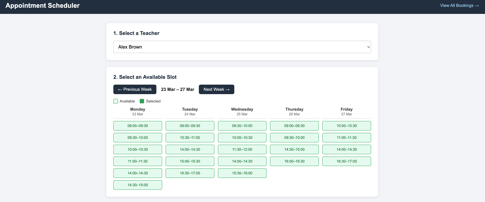

### Activity

Week 13 - Activity 4 - Django Web Application to Book an Appointment - Deadline (20.2.26 at midnigth)
You can continue W13-A3 by adding a module to the Book an Appointment page, allowing students to schedule a meeting with their lecturer during working hours in week.
 
Hint: You can use a simple text or JSON file to store the booking data. Include a screenshot of your development in the README with a short description and your GitHub link.

### Using the application

 