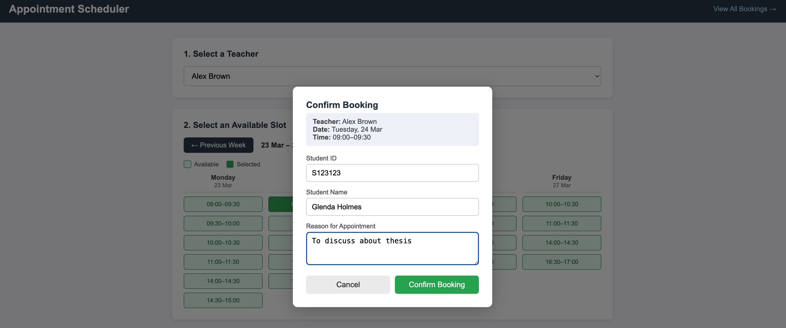
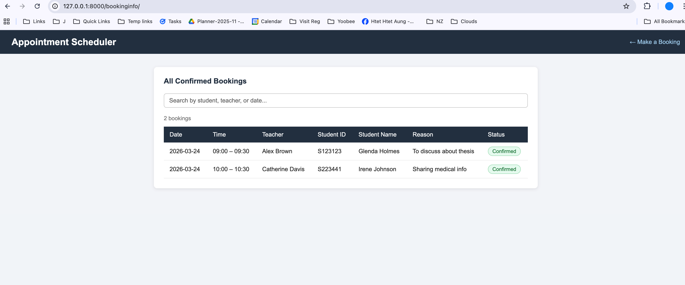

## Activity

Week 13 - Activity 4 - Django Web Application to Book an Appointment - Deadline (20.2.26 at midnigth)
You can continue W13-A3 by adding a module to the Book an Appointment page, allowing students to schedule a meeting with their lecturer during working hours in week.
 
Hint: You can use a simple text or JSON file to store the booking data. Include a screenshot of your development in the README with a short description and your GitHub link.

### Development Info
It is a web application hosted on Django, the services are implemented in Python, and the HTML templates are used to render the interactive web UI in the frontend. The availability of the teachers are provided as a predefined info in the `availability.json` file - mentioning the name of the teacher and the available dates and the slots - which are defined in a fixed way - for every 30-minute slots from 9:00 to 17:00. E.g. 09:00 to 09:30 is slot 1, 09:30 to 10:00 is slot 2 and so on. The user can access the web site freely and can view the availability info upon which the user can make an appointment booking by selecting an available slot, providing the necessary info such as Student ID, Name and Reason for the appointment. The booking appointment info is saved in booking.json.

### Using the application

1. To make an appointment, select the teacher that the user wants to have an appointment with, check the available slots and select one.

2. Proivde the user's info (Student ID, Name and Reason), then confirm the booking.

3. The confirmed booking information can be viewed as follows.

 